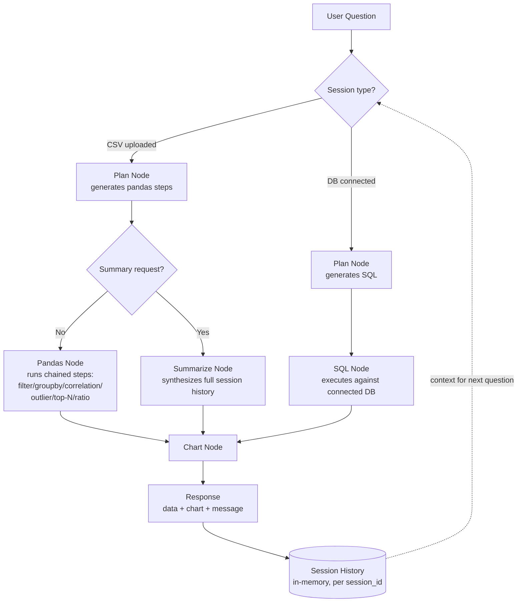

# DataPilot 🧭

**A natural-language data analysis agent — ask questions in plain English, get answers over your own CSV files or any SQL database, with charts generated automatically.**

<!-- TODO: embed demo video here -->

## Tech Stack

| Tool | Role | Why chosen |
|------|------|------------|
| **LangGraph** | Orchestration | Explicit state machine for routing between SQL/pandas/chart nodes — clearer and more debuggable than a linear chain for multi-path agent logic |
| **Groq (gpt-oss-120b)** | LLM inference | Fast, low-cost inference suited to a structured-JSON-output workload (vs. requiring a frontier model for free-form code generation) |
| **FastAPI** | Backend API | Async-native, session-based state per user, serves both the frontend and JSON endpoints |
| **pandas** | CSV analysis engine | Native DataFrame operations (groupby, filter, correlation, outliers) — no code generation needed |
| **MySQL** | DB-mode target | Real "bring your own database" support, tested against the Sakila sample DB |
| **Docker** | Containerization | Reproducible runtime — packages app + dependencies into one portable image |
| **LangSmith** | Observability | Full tracing on both SQL and CSV agent paths, used to debug planner behavior during development |
| **Plain HTML/JS** | Frontend | Chosen over Streamlit for production-grade UI customization (chat interface, session sidebar) |

## Key Features

- **Dual data sources** — connect to any MySQL database (bring your own credentials) or upload a CSV; both converge into the same analysis pipeline
- **Multi-turn conversation memory** — ask follow-up questions that reference earlier results ("filter *that* to the West region"), and request a full-session summary that synthesizes everything asked so far
- **Automatic chart generation** — bar, line, pie, scatter, histogram, and box charts rendered on demand and downloadable, no manual plotting
- **Structured, non-sandboxed execution** — every operation (groupby, filter, correlation, outliers, top-N, ratios) runs through a fixed, pre-approved schema rather than LLM-generated free code, eliminating arbitrary code execution risk entirely
- **Multi-step reasoning** — chains compound operations (e.g. filter → groupby → sort → limit) in a single question, verified against manual pandas cross-checks
- **Data profiling** — automatic column-level summary (type, nulls, unique count, min/max/mean) on upload, answering structural questions directly
- **Containerized** — packaged with Docker for reproducible, environment-independent deployment
- **Full observability** — LangSmith tracing wired across both SQL and CSV agent paths for debugging and transparency

## Architecture

DataPilot runs two parallel LangGraph pipelines — one for SQL databases, one for CSV/pandas — that converge on a shared chart-rendering step.



**Key design points:**
- **Session isolation** — each session (`session_id`) holds its own history, dataframe/db_config, and LangGraph instance; no shared global state across users
- **No free-form code generation** — the Pandas path only ever fills a fixed, pre-approved JSON schema (operation, column, filter, aggregation); the LLM never writes or executes arbitrary code
- **Shared chart step** — both pipelines converge on one Chart Node, so chart generation logic (and its 6 supported chart types) is written once and works identically regardless of data source

## Why These Design Choices

**No sandboxing, no free-form code generation.**
Chose structured JSON operations (a fixed, chainable step schema) over letting the LLM write and execute arbitrary Python/SQL.
*Why:* The project runs on `gpt-oss-120b` via Groq for cost reasons, not a frontier model — free code-gen demands much higher reliability than filling a structured schema does. Sandboxing solves a security problem this design doesn't have, since the model only ever fills pre-approved fields.
*Trade-off accepted:* Bounded to a fixed (if steadily extended) operation set — groupby, filter, correlation, outliers, ratios, top-N, percent-of-total — rather than truly arbitrary analysis.

**In-memory, per-session state — no database persistence.**
Each session's history, dataframe, and DB config live in a plain in-memory dict, keyed by `session_id`.
*Why:* Matches the actual use case (single-user demo sessions), and keeps the architecture simple enough to finish and verify thoroughly rather than half-build a persistence layer.
*Trade-off accepted:* A server restart wipes all active sessions; no multi-day session continuity. Documented as a clear next step for a real multi-user deployment (Redis or a database-backed session store).

**Real per-user DB credentials, not a fixed demo database.**
Users connect with their own MySQL credentials at runtime rather than the app shipping one hardcoded "demo DB."
*Why:* This is the realistic, production-shaped design — the same pattern as Metabase, Tableau, or Redash. The security-conscious part isn't refusing credentials, it's never persisting them to disk or logs, holding them only in memory for that session.
*Trade-off accepted:* Requires the user to have their own MySQL instance running; no true zero-setup demo mode.

**Plain HTML/JS frontend, not Streamlit.**
*Why:* Full control over the chat UI (session sidebar, chat bubbles, chart rendering) — Streamlit's component model is faster to prototype but harder to make look production-grade.
*Trade-off accepted:* More manual frontend work than a Streamlit app would need.

**Groq (`gpt-oss-120b`) over a frontier model.**
Chosen after a 12-question head-to-head comparison against `qwen/qwen3-8-27b`, run against this project's own database rather than relying on public benchmark tables. Full write-up: [`docs/model-selection.md`](docs/model-selection.md).
*Trade-off accepted:* An open-weight model is less reliable at complex, ambiguous, multi-table SQL generation than a frontier model — a known cause of the occasional SQL-mode failures documented below.

## Setup & Run

### Prerequisites
- Python 3.11+
- A [Groq API key](https://console.groq.com) (free tier available)
- (Optional, for DB mode) A running MySQL instance

### 1. Clone and configure

```bash
git clone https://github.com/Mohitkumar320/datapilot.git
cd datapilot
```

Create a `.env` file in the project root:

​```
GROQ_API_KEY=your_key_here
LANGSMITH_TRACING=true
LANGSMITH_API_KEY=your_key_here
LANGSMITH_PROJECT=datapilot
MYSQL_PASSWORD=your_mysql_password_here
​```

> Note: no quotes around values — some tools (like Docker's `--env-file`) parse `.env` literally and will break if values are quoted.

### 2. Run locally

```bash
pip install -r requirements.txt
uvicorn app.api.main:app --reload --port 8000
```
Open `http://127.0.0.1:8000/static/index.html`

### 3. Or run with Docker

```bash
docker build -t datapilot .
docker run --env-file .env -p 8000:8000 datapilot
```
Open `http://127.0.0.1:8000/static/index.html`

> If your MySQL database runs on your host machine (not in Docker), use `host.docker.internal` instead of `localhost` when connecting to your DB from the app's "Connect Database" tab — `localhost` inside a container refers to the container itself, not your machine.

## Known Limitations

These are deliberate scope decisions for a time-boxed solo project, not oversights — noted here for transparency.

- **In-memory sessions** — session state (history, dataframe, DB config) lives in a plain dict, not a database. A server restart wipes all active sessions. A production version would move this to Redis or a persistent store.
- **Global chart file (not per-session)** — `/chart` serves one shared `outputs/latest_chart.png`. Fine for single-user demo sessions; concurrent users would overwrite each other's chart. Per-session filenames would be a quick fix if needed.
- **No date/time operations** — trend-over-time and growth-comparison questions ("which category grew fastest") aren't supported; out of scope for the current operation set.
- **DB-mode SQL generation is less deterministic than CSV-mode's structured steps** — since SQL is generated as free text (not filled into a fixed schema), complex multi-turn compound queries occasionally fail where the equivalent CSV-mode question would not. This is a direct trade-off of using an open-weight model (`gpt-oss-120b`) for SQL generation — see [`docs/model-selection.md`](docs/model-selection.md).
- **No premise validation** — the agent answers the question as asked, even if a premise is factually wrong (e.g. asking "what's driving *low* profit in region X" when X is actually the highest-profit region). It doesn't currently push back on false assumptions in the question itself.
- **CSV-mode operation set is fixed** — groupby, filter, correlation, outlier detection, ratios, top-N, and percent-of-total are supported; arbitrary custom calculations are not, by design (see "Why These Design Choices" above).


## Project Structure

```
datapilot/
├── app/
│   ├── main.py                  # terminal entry point (early scaffolding)
│   ├── api/
│   │   └── main.py              # FastAPI app: /upload-csv, /connect-db, /ask, /chart
│   ├── agents/
│   │   └── graph.py             # LangGraph state machine (SQL + CSV pipelines)
│   ├── sql/
│   │   ├── schema.py            # DB schema introspection
│   │   ├── generator.py         # LLM-driven SQL generation
│   │   └── executor.py          # runs generated SQL against connected DB
│   └── pandas_tools/
│       ├── loader.py            # CSV loading
│       ├── planner.py           # LLM-driven structured step planning
│       ├── executor.py          # runs chained pandas operations
│       ├── charts.py            # chart rendering (bar/line/pie/scatter/histogram/box)
│       ├── profiler.py          # automatic data profiling on upload
│       └── summarizer.py        # full-session summary generation
├── frontend/
│   ├── index.html               # chat UI
│   └── app.js                   # fetch calls to FastAPI endpoints
├── data/                        # sample CSVs for testing
├── docs/
│   └── model-selection.md       # LLM comparison write-up
├── evals/                       # evaluation scripts/metrics
├── outputs/                     # generated chart images (gitignored)
├── uploads/                     # uploaded CSVs per session (gitignored)
├── Dockerfile
├── .dockerignore
├── .gitignore
├── requirements.txt
└── README.md
```